# Proposta

Plataforma de solicitação de pedidos em um café fictício

## Funcionalidades

- Loguin com reatividade 
- Registro dos pedidos feitos na tela inicial
- Busca por nome nas telas de pedidos realizados, Produtos e Clientes
- Utilização de um calendario para seleciona a data da realização do pedido

## Gifs e Algumas Imagens

Fluxo novo Pedido

Algumas Imagens

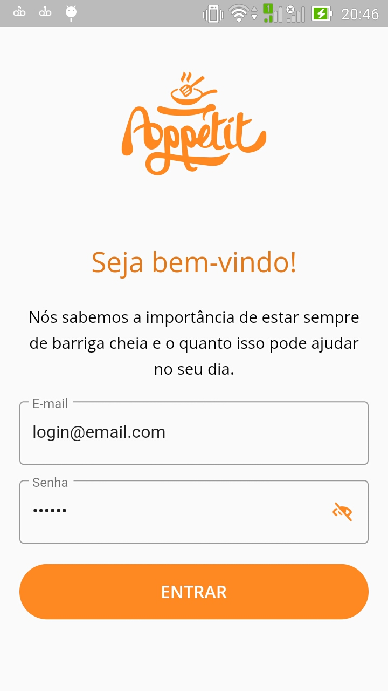  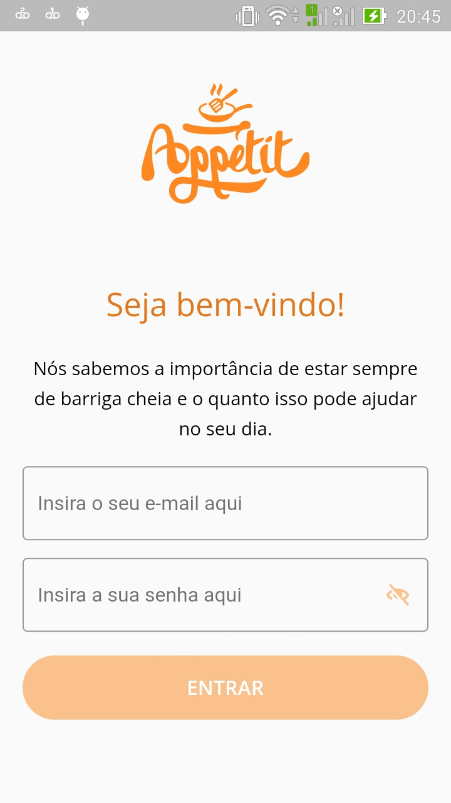  

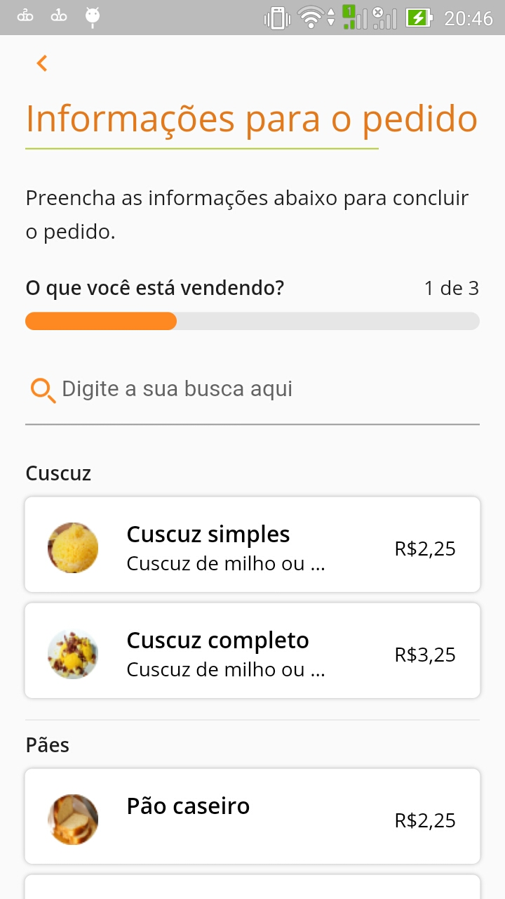  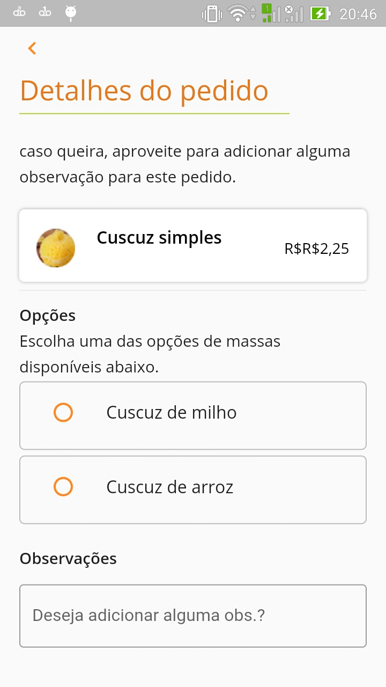 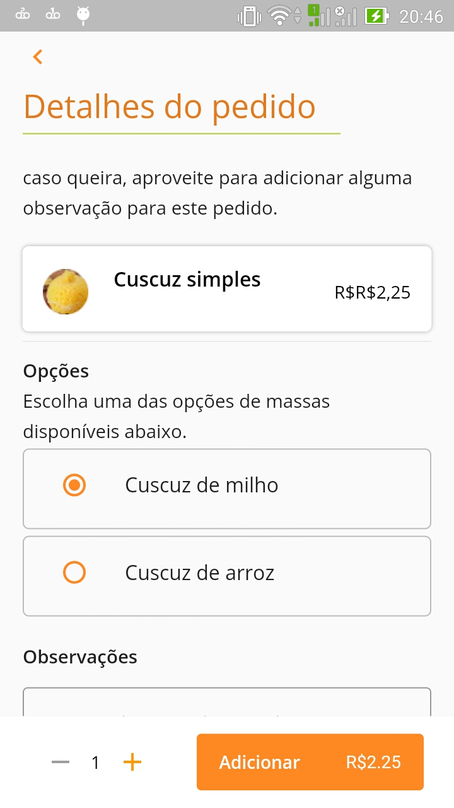 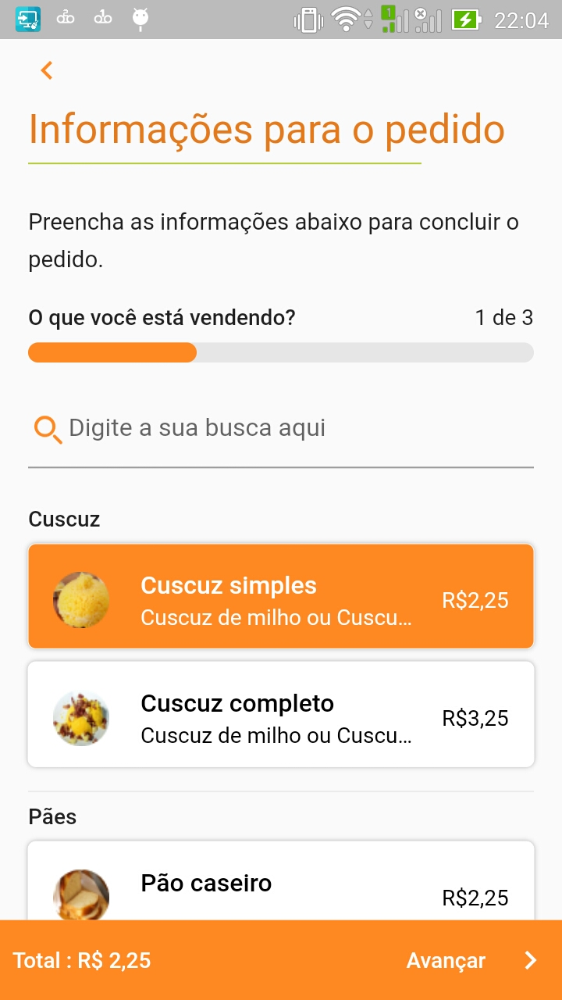

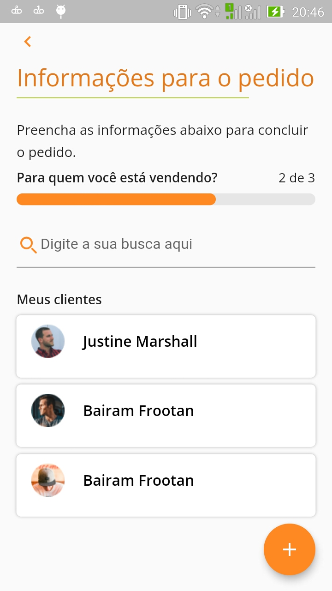  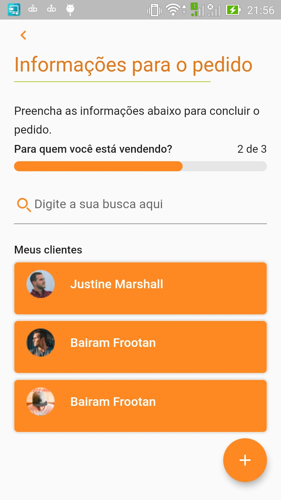 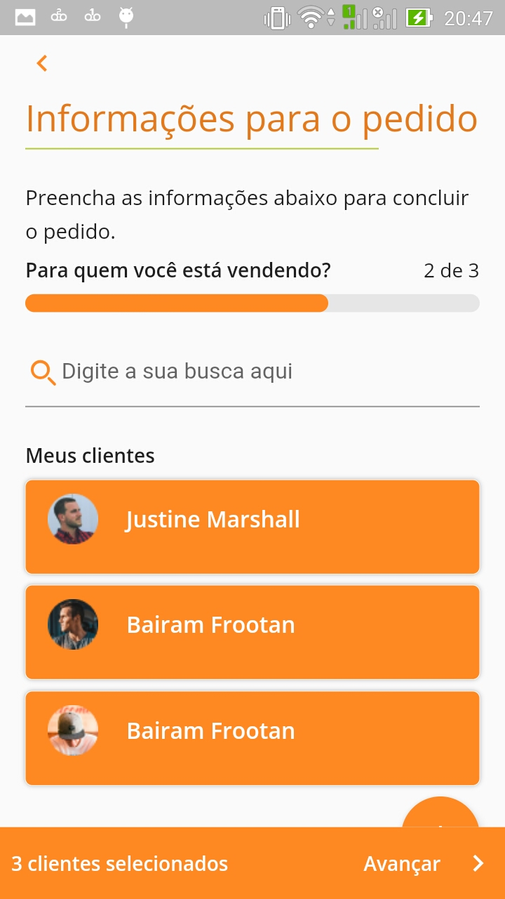

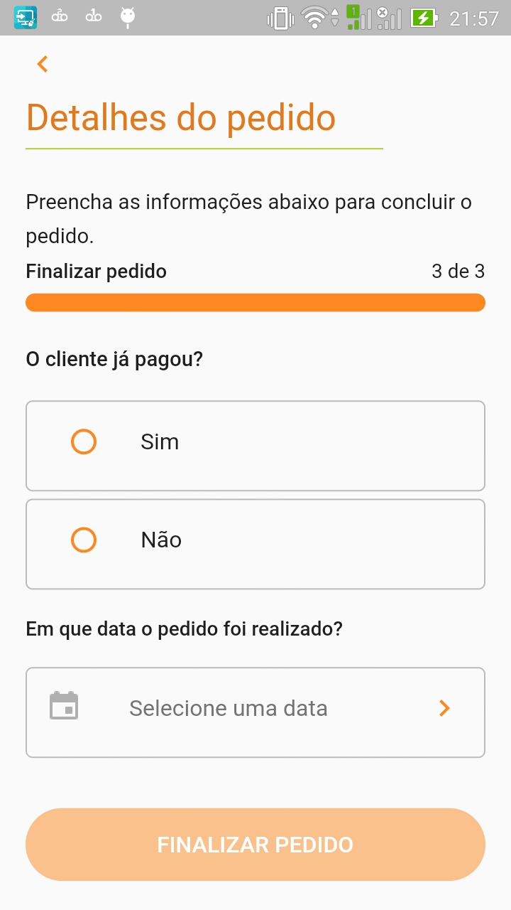 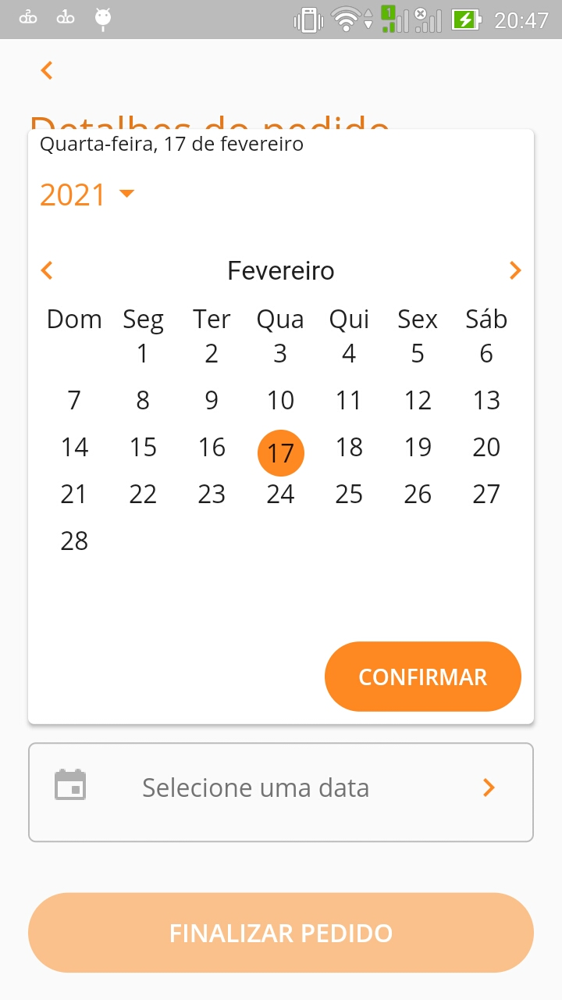  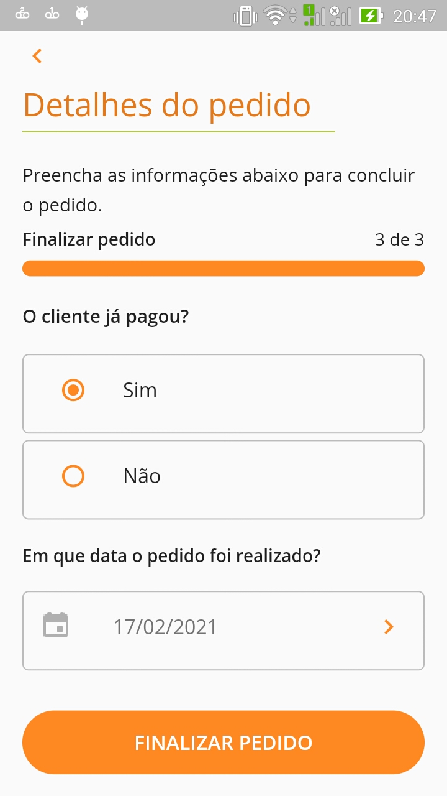 

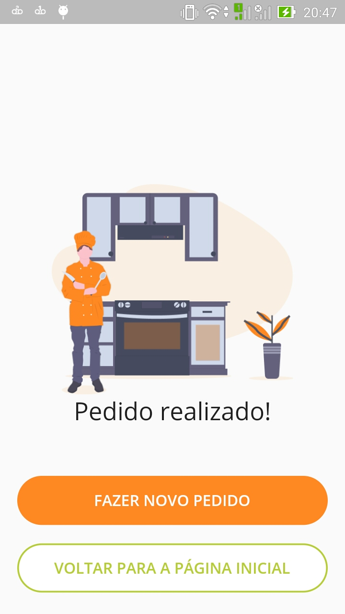

##Dicas de Uso

Para logar basta preencher os campos do formulario de Loguin, assim que o botão mudar de cor já é possivel ir para tela incial.
Na pasta Readme tem uma pasta com o apk gerado para instalação e teste, escolher conforme o sistema, possivelmente para instalar no android é preciso habilitar nas configurações do celular permitir instalações de fontes desconhecidas.

##Ferramentas Usadas

Foi implementado gerencia de estados entre as telas com uso do  Flutter Mobx, e ferramentas já presentes no Flutter.

Dependencies:

-[Mobx](https://pub.dev/packages/mobx)

-[Flutter mobx](https://pub.dev/packages/flutter_mobx)

Dev Dependencies:

-[Mobx codegen](https://pub.dev/packages/mobx_codegen)

-[Build Runner](https://pub.dev/packages/build_runner)

Utilizou-se do pacote de fontes da google.

Dependencies:

-[Google fonts](https://pub.dev/packages/google_fonts)

Para implementar o calendario:

Dependencies:

-[Table calendar](https://pub.dev/packages/table_calendar)

Para auxiliar na linguagem do calendario e manipulação de Datas

Dependencies:

-[Intl](https://pub.dev/packages/intl)

Utilizou-se de imagens no formato svg.

Dependencies:

-[Flutter svg](https://pub.dev/packages/flutter_svg)

Para compartilha os estados entre as telas usou-se o Pacote Provider.

Dependencies:

-[Provider](https://pub.dev/packages/provider)

